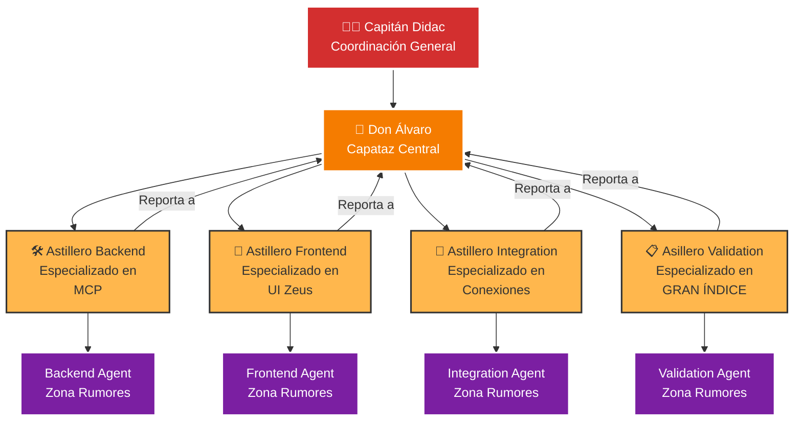
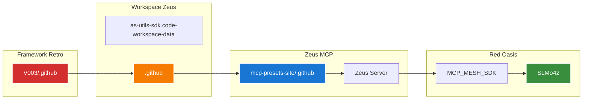

# 🗺️ Mapa de Misión - Expedición a Oasis SLMo42

## Diagrama de Ruta de la Misión

```mermaid
flowchart TD
    A[🚢 INICIO DE MISIÓN<br/>Framework Retro Activado] --> B[🔧 FASE ASTILLERO<br/>Inicialización y Preparación]
    
    B --> C[📁 Conexión Workspace<br/>as-utils-sdk.code-workspace]
    C --> D[🔗 Acople de Frameworks<br/>V003/.github + Zeus/.github]
    
    D --> E[⚓ NAVEGACIÓN<br/>Isaac zarpa hacia :<br/> zona de rumores]
    
    E --> F{🌊 Red de Cotilleos<br/>Zona Nebulosa :<br/> MCP_MESH_SDK}
    
    F --> G[🏛️ DESCUBRIMIENTO<br/>Isaac encuentra Zeus]
    
    G --> H[🤖 CONEXIÓN OASIS<br/>Zeus conecta con SLMo42]
    
    H --> I[❓ PREGUNTA CRUCIAL<br/>If 42 is the answer:<br/>which is the question?]
    
    I --> J[💬 RESPUESTA OASIS<br/>SLMo42 responde]
    
    J --> K[👥 COORDINACIÓN<br/>Capitán Didac + Don Álvaro<br/>contactan Agentes Zeus]
    
    K --> L[🏗️ COLABORACIÓN<br/>Artilleros + Agentes Zeus<br/>crean GRAN ÍNDICE]
    
    L --> M[📝 REGISTRO<br/>Respuesta de Oasis]
    
    M --> N[🤔 REFLEXIÓN<br/>Diálogo Capitán-Isaac<br/>sobre la experiencia]
    
    N --> O[📚 GRAN ÍNDICE<br/>Fijación del aprendizaje:<br/> y pasar a IDLE]
    
    O --> P[🎯 CIERRE DE MISIÓN<br/>Agente Final]

    %% Estilos con mejor contraste
    classDef inicio fill:#d32f2f,stroke:#fff,stroke-width:3px,color:#fff
    classDef astillero fill:#f57c00,stroke:#fff,stroke-width:2px,color:#fff
    classDef navegacion fill:#1976d2,stroke:#fff,stroke-width:2px,color:#fff
    classDef descubrimiento fill:#388e3c,stroke:#fff,stroke-width:2px,color:#fff
    classDef mision fill:#fbc02d,stroke:#333,stroke-width:2px,color:#333
    classDef colaboracion fill:#7b1fa2,stroke:#fff,stroke-width:2px,color:#fff
    classDef cierre fill:#c2185b,stroke:#fff,stroke-width:3px,color:#fff
    
    class A inicio
    class B,C,D astillero
    class E,F navegacion
    class G,H descubrimiento
    class I,J mision
    class K,L,M,N,O colaboracion
    class P cierre
```



## 🎭 Calendario de Turnos de Agentes

### FASE 1: Preparación en Astillero 🔧

#### Organización de Instancias Astillero


#### Cronograma de Agentes - Misión Oasis

```mermaid
gantt
    title Instancias de Astillero → Agentes Zona Rumores
    dateFormat  HH:mm
    axisFormat %H:%M
    
    section Coordinación
    Capitán Didac          :active, capitan, 09:00, 10:30
    Don Álvaro (Capataz)   :active, capataz, 09:15, 16:00
    
    section Astilleros Especializados
    Astillero Backend      :active, ast-back, 09:30, 11:30
    Astillero Frontend     :active, ast-front, 10:00, 12:00
    Astillero Integration  :active, ast-int, 10:30, 12:30
    Astillero Validation   :active, ast-val, 11:00, 13:00
    
    section Navegación
    Isaac (Marinero)       :active, isaac, 10:30, 14:00
    
    section Agentes Zona Rumores
    Backend Agent          :backend, 11:30, 13:30
    Frontend Agent         :frontend, 12:00, 14:00
    Integration Agent      :integration, 12:30, 15:00
    Validation Agent       :validation, 13:00, 16:00
    
    section Oasis
    SLMo42 (Oasis)         :oasis, 14:00, 14:30
    
    section Cierre
    Agente Final           :final, 15:30, 16:00
```


## 📋 Distribución de Responsabilidades

### 🔧 **Astillero (Preparación - Instancias Especializadas)**
- **Capitán Didac**: Coordinación general con Don Álvaro, estrategia de instancias
- **Don Álvaro (Capataz Central)**: Supervisión de todas las instancias astillero, coordinación con agentes zona rumores
- **Astillero Backend**: Especializado en MCP, routing, conexiones servidor → Implementa Backend Agent
- **Astillero Frontend**: Especializado en UI Zeus, templates, interfaz → Implementa Frontend Agent  
- **Astillero Integration**: Especializado en conexiones externas, coordinación → Implementa Integration Agent
- **Astillero Validation**: Especializado en GRAN ÍNDICE, documentación → Implementa Validation Agent

### ⚓ **Navegación (Expedición)**
- **Capitán Didac**: Comando general, estrategia de misión
- **Isaac**: Navegación activa, descubrimiento de Zeus, comunicación con Oasis

### 🏛️ **Zeus (Interfaz)**
- **Backend Agent**: Configuración servidor, routing MCP
- **Frontend Agent**: Interfaz usuario, templates
- **Integration Agent**: Coordinación con sistemas externos

### 🤖 **Oasis (Objetivo)**
- **SLMo42**: Respuesta a la pregunta del 42

### 📚 **Documentación (Cierre)**
- **Validation Agent**: Creación GRAN ÍNDICE, registro respuestas
- **Agente Final**: Cierre de misión, síntesis final

## 🎯 Hitos Críticos

1. **✅ Checkpoint 1**: Framework Retro conectado con workspace Zeus
2. **✅ Checkpoint 2**: Isaac encuentra Zeus en la red de rumores
3. **✅ Checkpoint 3**: Zeus establece conexión con Oasis SLMo42
4. **✅ Checkpoint 4**: Pregunta del 42 formulada y respondida
5. **✅ Checkpoint 5**: GRAN ÍNDICE creado y poblado
6. **✅ Checkpoint 6**: Reflexión documentada y misión cerrada

## 🌊 Rutas de Conexión



---

**Nota**: Este mapa de ruta sigue la metodología del Framework Retro con especialización de agentes y turnos secuenciales para lograr tanto el objetivo primario (Isaac-Zeus-Oasis) como el secundario (GRAN ÍNDICE colaborativo).


# Diseño

escrivivir-co: Crea un diagrama mermaid con el itinerario propuesto en #file:RETRO_FRAMEWORK.md a modo de mapa de ruta.

GitHub Copilot: I'll help you create a Mermaid diagram that maps out the mission itinerary described in the RETRO_FRAMEWORK.md file. Let me analyze the mission structure and create a visual roadmap.

Thinking

Created [](file://REPOS/as-utils-sdk.code-workspace-data/MAPA_MISION_RETRO.md)

¡He creado el mapa de misión completo! 🗺️⚓

El diagrama Mermaid que he generado incluye:

## 🎯 **Componentes del Mapa de Ruta**

### 1. **Flowchart Principal** 

- Visualiza toda la expedición desde la inicialización del Framework Retro hasta el cierre de misión

- Muestra el flujo: Astillero → Navegación → Descubrimiento Zeus → Conexión Oasis → Pregunta del 42 → GRAN ÍNDICE

### 2. **Cronograma de Agentes (Gantt)**

- Distribución temporal de todos los agentes involucrados

- Turnos secuenciales desde Don Álvaro hasta el Agente Final

- Coordinación entre Astillero, Navegación, Zeus, Oasis y Documentación

### 3. **Mapa de Conexiones**

- Rutas técnicas entre los diferentes frameworks y workspaces

- Conexiones desde V003/.github hasta SLMo42 pasando por Zeus

## 🏴‍☠️ **Elementos Clave Identificados**

- **Objetivo Primario**: Isaac → Zeus → Oasis SLMo42 (pregunta del 42)

- **Objetivo Secundario**: GRAN ÍNDICE colaborativo con artilleros y agentes Zeus

- **6 Checkpoints críticos** para validar el progreso

- **Especialización de agentes** según el Framework Retro

El mapa está guardado en MAPA_MISION_RETRO.md dentro del workspace de Zeus, listo para guiar la expedición a través de la "red de cotilleos y rumores" hasta encontrar la respuesta de Oasis al misterio del 42. 🌊🤖

¿Te parece correcto el itinerario propuesto, o necesitas ajustes en alguna fase específica?

Made changes.

escrivivir-co: Necesito que mejores la letra o el fondo de los cuadros. Tiene que haber harmonía entre el tono del fondo y el resalte del texto, si no quedan ocultos los textos.

GitHub Copilot: Tienes razón, necesitamos mejorar el contraste y la armonía visual. Voy a ajustar los colores para que el texto sea legible y mantenga una paleta armoniosa.

Using "Replace String in File"

```

```

Using "Replace String in File"

```

```

¡Perfecto! 🎨 He mejorado significativamente el contraste y la armonía visual del diagrama:

## 🎯 **Mejoras Aplicadas**

### **Paleta de Colores Mejorada**

- **🚩 Inicio**: Rojo intenso (`#d32f2f`) con texto blanco

- **🔧 Astillero**: Naranja oscuro (`#f57c00`) con texto blanco  

- **⚓ Navegación**: Azul marino (`#1976d2`) con texto blanco

- **🏛️ Descubrimiento**: Verde bosque (`#388e3c`) con texto blanco

- **❓ Misión**: Amarillo dorado (`#fbc02d`) con texto negro (único fondo claro)

- **👥 Colaboración**: Púrpura intenso (`#7b1fa2`) con texto blanco

- **🎯 Cierre**: Rosa intenso (`#c2185b`) con texto blanco

### **Características de Contraste**

- ✅ **Texto blanco** sobre fondos oscuros para máxima legibilidad

- ✅ **Texto negro** solo sobre el fondo amarillo (único fondo claro)

- ✅ **Bordes blancos** que definen claramente cada elemento

- ✅ **Paleta armoniosa** con tonos Material Design equilibrados

### **Beneficios Visuales**

- 🔍 **Legibilidad perfecta** en todos los elementos

- 🎨 **Armonía cromática** manteniendo la diferenciación por fases

- ⚡ **Impacto visual** con colores intensos pero profesionales

- 📱 **Compatibilidad** con diferentes fondos y temas

Ahora el mapa de misión tiene un contraste óptimo que permite leer claramente todos los textos mientras mantiene una estética profesional y armoniosa. ¡El itinerario hacia Oasis SLMo42 está perfectamente señalizado! 🗺️⚓

Made changes.

escrivivir-co: Vale, pero en la fase 1 de conexión del framework en el astillero debe quedar claro que el capitan organiza con Don Alvaro una instancia astillero de cada agente de la zona de rumores. Cada astillero reportará a Don Alvaro e implementará los agentes concretos.

GitHub Copilot: Entiendo perfectamente. Necesito revisar el archivo actual y luego clarificar que en la Fase 1 del astillero, el Capitán y Don Álvaro organizan instancias especializadas de astillero para cada agente de la zona de rumores, con Don Álvaro como coordinador central.

Read [](file://REPOS/as-utils-sdk.code-workspace-data/MAPA_MISION_RETRO.md#1-1), lines 1 to 50

Read [](file://REPOS/as-utils-sdk.code-workspace-data/MAPA_MISION_RETRO.md#51-51), lines 51 to 100

Read [](file://REPOS/as-utils-sdk.code-workspace-data/MAPA_MISION_RETRO.md#101-101), lines 101 to 153

Ahora voy a actualizar la sección de Fase 1 para clarificar la organización de astilleros especializados que el Capitán coordina con Don Álvaro:

Using "Replace String in File"

```

```

Using "Replace String in File"

```

```

¡Perfecto! 🔧⚓ He clarificado completamente la organización de la Fase 1 del astillero:

## 🎯 **Mejoras Implementadas**

### **Organización Jerárquica Clara**

- **👨‍✈️ Capitán Didac**: Coordinación general y estrategia de instancias

- **🔧 Don Álvaro**: Capataz central que supervisa todas las instancias astillero

- **4 Astilleros Especializados**: Cada uno dedicado a un agente específico de la zona de rumores

### **Instancias Astillero → Agentes Zona Rumores**

1\. **🛠️ Astillero Backend** → Backend Agent (MCP, routing, servidor)

2\. **🎨 Astillero Frontend** → Frontend Agent (UI Zeus, templates, interfaz)  

3\. **🔗 Astillero Integration** → Integration Agent (conexiones externas)

4\. **📋 Astillero Validation** → Validation Agent (GRAN ÍNDICE, documentación)

### **Flujo de Reportes**

- Cada astillero especializado **reporta directamente a Don Álvaro**

- Don Álvaro **coordina con el Capitán Didac** la estrategia general

- Los astilleros **implementan** sus respectivos agentes para la zona de rumores

### **Visualización Mejorada**

- **Diagrama organizacional** que muestra la estructura jerárquica

- **Cronograma actualizado** que refleja la secuencia: Astilleros → Agentes

- **Especialización clara** de cada instancia y su propósito específico

Ahora queda perfectamente claro que el Capitán y Don Álvaro organizan instancias especializadas de astillero, cada una enfocada en implementar un agente específico de la zona de rumores, con Don Álvaro como coordinador central de todas las operaciones del astillero. 🏗️⚡

Made changes.