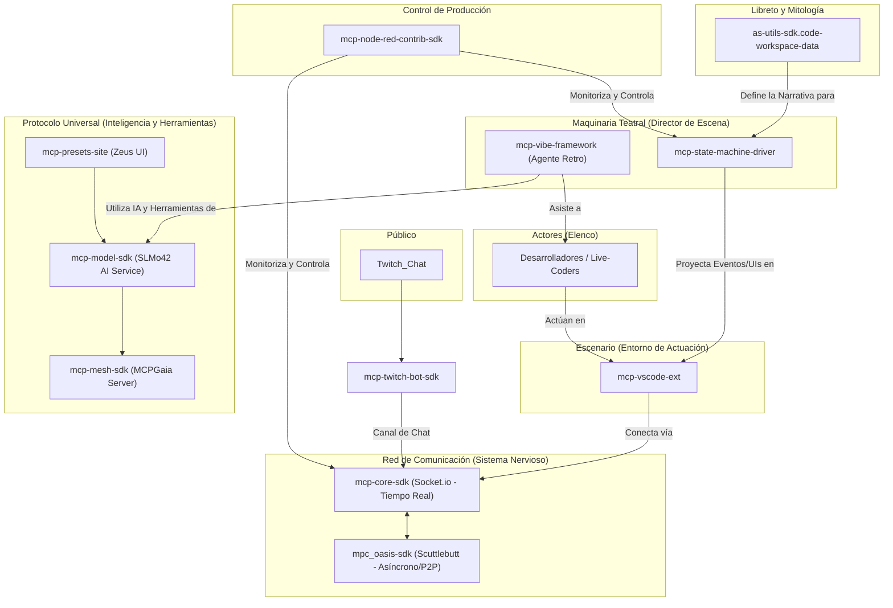

# 🎭 Arquitectura del Ecosistema Transmedia

Este documento describe la arquitectura general del "Teatro de Realidad Aumentada", un ecosistema diseñado para crear narrativas interactivas y colaborativas a través de live-coding y streaming.

## Leyenda de Componentes

*   **Público**: Los espectadores que interactúan desde plataformas como Twitch.
*   **Actores (Elenco)**: Los desarrolladores o creadores que realizan el live-coding.
*   **Escenario**: El entorno de desarrollo (VS Code) donde ocurre la "actuación".
*   **Red de Comunicación**: La infraestructura de red que conecta a todos los participantes, tanto en tiempo real como de forma asíncrona.
*   **Maquinaria Teatral**: Los sistemas que dirigen la narrativa, gestionan los eventos y asisten a los actores.
*   **Control de Producción**: Herramientas para que los administradores supervisen y gestionen el "espectáculo".
*   **Protocolo Universal (MCP)**: La columna vertebral de IA y herramientas que dota de inteligencia y capacidades al ecosistema.
*   **Libreto y Mitología**: La base de conocimiento que contiene la narrativa, lore y guiones del universo.
